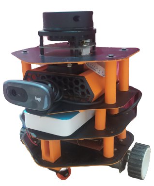

# TikkaBot
ROS robot inspired by TurtleBot 3 Burger

 

## CAD Model

 

## Components Used

- Jetson Nano
- Arduino UNO
- L298N Motor Driver
- HC-05 Bluetooth Module
- 3D Printed Parts
- 5V 2.4A Power Bank
- RPLidar
- Webcam
- 11.1V 3S Lithium Ion Battery Pack
- 10 RPM DC Gear Motor with encoder
- 55mm wheels

## Circuit v1 (Bluetooth Control)

